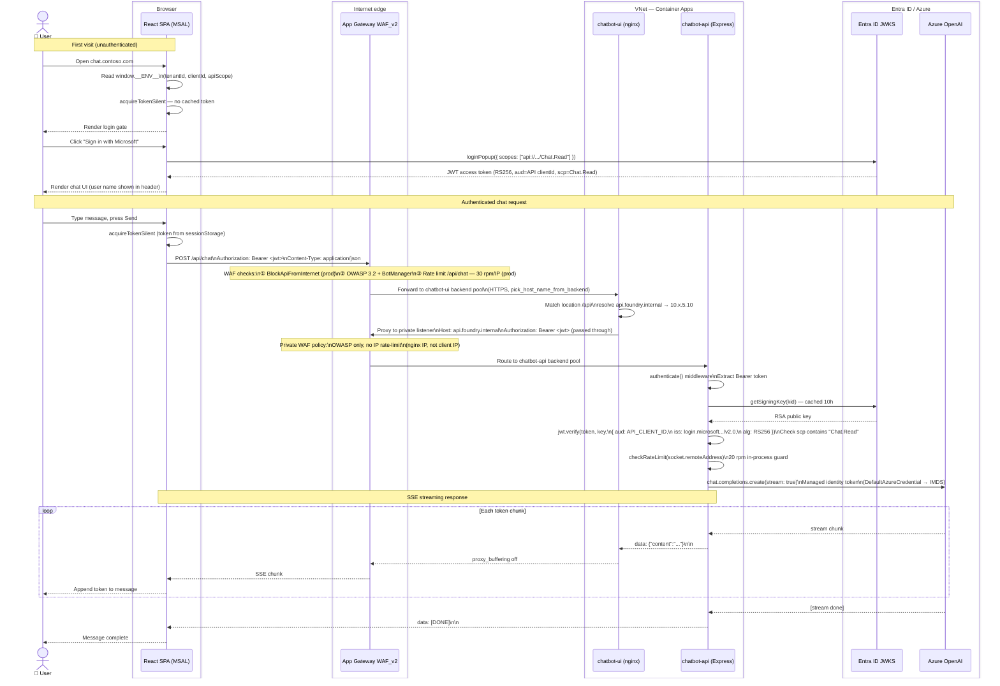
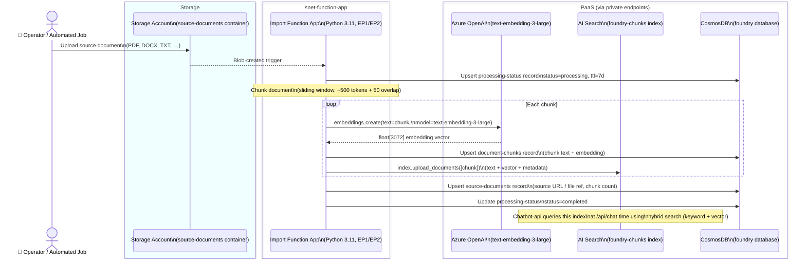
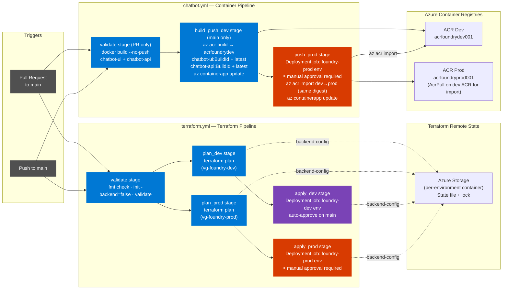

# Foundry Platform — Architecture

Four diagrams cover the platform:

1. [Infrastructure Overview](#1-infrastructure-overview) — all Azure resources and network topology
2. [Chatbot Request Flow](#2-chatbot-request-and-authentication-flow) — browser → AGW → nginx → API → OpenAI, with JWT auth
3. [Document Ingestion Flow](#3-document-ingestion-flow) — blob upload → Function App → AI Search + CosmosDB
4. [CI/CD Pipeline Flow](#4-cicd-pipeline-flow) — Terraform and container deployment pipelines

---

## 1. Infrastructure Overview

```mermaid
graph TD
    %% ── External ────────────────────────────────────────────────────────────────
    User(["👤 User\nBrowser"])
    ADO(["🔧 Azure DevOps\nCI/CD Pipelines"])
    EntraID(["🔑 Entra ID\nchatbot-api app reg\nchatbot-ui app reg"])

    %% ── Azure VNet ──────────────────────────────────────────────────────────────
    subgraph VNET["Azure VNet — 10.x.0.0/16"]

        subgraph AGW_SUBNET["snet-agw  10.x.5.0/24"]
            AGW["Application Gateway WAF_v2\nPublic listener — chat.contoso.com\nPrivate listener — api.foundry.internal:10.x.5.10\nOWASP + BotManager + rate-limit rules"]
        end

        subgraph CAE_SUBNET["snet-container-apps  10.x.4.0/24"]
            subgraph CAE["Container Apps Environment — internal LB only"]
                UI["chatbot-ui\nnginx 1.27 · React SPA\nMSAL browser auth\nProxies /api/ → private listener"]
                CAPI["chatbot-api\nNode.js 20 · Express\nJWT validation middleware\nSSE streaming"]
            end
        end

        subgraph FUNC_SUBNET["snet-function-app  10.x.6.0/26"]
            FUNC["Import Function App\nPython 3.11 · EP1/EP2\nBlob trigger → chunk + embed → index"]
        end

        subgraph AGENTS_SUBNET["snet-agents  10.x.2.0/27"]
            AGENTS["AI Foundry\nAgent Service"]
        end

        subgraph PE_SUBNET["snet-private-endpoints  10.x.1.0/24"]
            PE_OAI["PE → OpenAI"]
            PE_SRCH["PE → AI Search"]
            PE_COSMOS["PE → CosmosDB"]
            PE_KV["PE → Key Vault"]
            PE_ST["PE → Storage"]
            PE_ACR["PE → Container Registry"]
            PE_FUNC["PE → Function App"]
            PE_MON["PE → Monitor / Log Analytics"]
        end
    end

    %% ── PaaS Services ───────────────────────────────────────────────────────────
    subgraph PAAS["Azure PaaS — private-endpoint accessible"]
        OAI["Azure OpenAI\ngpt-4o · gpt-4o-mini\ntext-embedding-3-large\no1 (prod only)"]
        SRCH["AI Search\nbasic (dev) · standard (prod)\nIndex: foundry-chunks"]
        COSMOS["CosmosDB\nServerless (dev)\nProvisioned 10k RU/s (prod)\nContinuous backup (prod)"]
        KV["Key Vault\nstandard (dev)\npremium + CMK (prod)\nPurge protection enabled"]
        ST["Storage Account\nSource documents\nLRS (dev) · ZRS (prod)"]
        ACR["Container Registry\nStandard (dev)\nPremium (prod)"]
    end

    %% ── AI Foundry ──────────────────────────────────────────────────────────────
    subgraph FOUNDRY["AI Foundry"]
        HUB["AI Hub\naih-foundry-env-eus-001\nAllowOnlyApprovedOutbound (prod)"]
        P_CHAT["Project: chat\nChat + RAG"]
        P_EVAL["Project: eval\nEvaluation"]
        P_AGENTS["Project: agents\n(prod only)"]
        HUB --> P_CHAT
        HUB --> P_EVAL
        HUB --> P_AGENTS
    end

    %% ── Monitoring ──────────────────────────────────────────────────────────────
    subgraph MON["Monitoring"]
        LOG["Log Analytics\n30 days (dev) · 90 days (prod)\nNSG + VNet flow logs"]
        APPI["Application Insights\nSSE trace · dependency map"]
    end

    BUDGET["💰 Budget Alert\n$200/mo dev · $2 000/mo prod"]

    %% ── Traffic flows ───────────────────────────────────────────────────────────
    User        -->|HTTPS 443| AGW
    ADO         -->|az acr build / az containerapp update| ACR
    ADO         -->|terraform plan/apply| VNET

    AGW         -->|HTTPS backend pool| UI
    AGW         -.->|private listener\napi.foundry.internal| CAPI
    UI          -->|proxy /api/\n+ Authorization header| AGW

    CAPI        --> PE_OAI   --> OAI
    CAPI        --> PE_SRCH  --> SRCH
    CAPI        --> PE_COSMOS --> COSMOS
    CAPI        --> PE_KV    --> KV

    FUNC        -->|service endpoint| ST
    FUNC        --> PE_OAI
    FUNC        --> PE_SRCH
    FUNC        --> PE_COSMOS

    AGENTS      --> PE_OAI
    AGENTS      --> PE_SRCH

    ACR         --> PE_ACR
    FUNC        --> PE_FUNC

    CAPI        -.->|validate JWT\nJWKS endpoint| EntraID
    User        -.->|MSAL login| EntraID

    OAI         -.->|private DNS + PE| FOUNDRY
    SRCH        -.-> FOUNDRY
    COSMOS      -.-> FOUNDRY

    CAE         -.->|diag| LOG
    AGW         -.->|diag| LOG
    FUNC        -.->|diag| LOG
    CAPI        -.->|traces| APPI
    UI          -.->|traces| APPI
    BUDGET      -.-> LOG

    %% ── Styles ──────────────────────────────────────────────────────────────────
    classDef network   fill:#0078d4,color:#fff,stroke:#005a9e
    classDef compute   fill:#107c10,color:#fff,stroke:#054b05
    classDef paas      fill:#7a43b6,color:#fff,stroke:#5c3188
    classDef security  fill:#d83b01,color:#fff,stroke:#a32a00
    classDef monitor   fill:#ff8c00,color:#fff,stroke:#cc7000
    classDef external  fill:#505050,color:#fff,stroke:#333

    class AGW network
    class UI,CAPI,FUNC,AGENTS compute
    class OAI,SRCH,COSMOS,ST,ACR paas
    class KV,EntraID security
    class LOG,APPI,BUDGET monitor
    class User,ADO external
```

---

## 2. Chatbot Request and Authentication Flow

---

## 3. Document Ingestion Flow

---

## 4. CI/CD Pipeline Flow

---

## Network Security Summary

| Subnet | NSG Inbound | NSG Outbound | Notes |
|--------|-------------|--------------|-------|
| `snet-agw` | GatewayManager (65200-65535), AzureLB, HTTPS 443, HTTP 80 from Internet | VNet only (Deny-All-Internet) | AGW subnet requires GatewayManager rule |
| `snet-container-apps` | VNet (443, 80) only; Deny-Internet-Inbound @ 4096 | — | Internal LB: no public FQDN |
| `snet-function-app` | No inbound | VNet, AzureCloud 443; Deny-All-Internet | Outbound via service endpoints |
| `snet-agents` | Deny-All-Inbound | — | AI Foundry Agent Service delegation |
| `snet-private-endpoints` | VNet only; Deny-All-Inbound | — | All PaaS traffic stays in VNet |

## Key Security Controls

| Control | Implementation |
|---------|---------------|
| **TLS everywhere** | AGW terminates public TLS; backends use HTTPS with Container Apps managed certs; `min_tls_version = TLS1_2` on all storage |
| **Zero public PaaS endpoints** | All PaaS services reachable only via private endpoints; `public_network_access_enabled = false` |
| **Chatbot-api not internet-routable** | Internal CAE LB + NSG Deny-Internet-Inbound + no public path on AGW |
| **JWT authentication** | Entra ID RS256 tokens; validated via JWKS on every `/api/chat` call; `aud`, `iss`, `scp` verified |
| **WAF** | OWASP 3.2 + BotManager 1.1 on both listeners; per-IP rate limits on public listener; `/api/` hard-blocked from internet (prod) |
| **Managed Identity** | Every Container App and Function App has its own user-assigned identity with least-privilege RBAC |
| **Customer-Managed Keys** | Key Vault Premium + CMK enabled in prod; purge protection on all Key Vaults |
| **Audit logging** | NSG flow logs (VNet-level) + diagnostic settings on every resource → Log Analytics |
